# 执行计划 — vidforge

## 详细分析摘要

### 变更范围
- **项目类型**：Greenfield（全新），单一可交付物（一个 Electron 桌面应用）。
- **主要构建内容**：UI 层（React/TS，四种能力的素材输入 + 参数面板 + 任务队列面板 + 历史库）、任务管理层（并发队列 + 状态机 + 轮询 + 持久化 + 重启恢复）、API 客户端层（HappyHorse 统一端点封装 + 错误码映射）、存储层（任务持久化 + 历史记录 + 视频下载落盘）、配置/密钥层（OS 密钥链 + region + 自定义 baseURL）、i18n。

### 变更影响评估
- **用户可见变更**：是 — 这是一个完整的端到端 GUI 应用。
- **结构性变更**：是 — 需要从零定义模块边界与进程间（Electron main/renderer）职责划分。
- **数据模型变更**：是 — 任务实体、历史记录实体、配置实体需要 schema。
- **API 变更**：是（对外）— 封装 HappyHorse 的 4 个 model + 轮询 + 任务查询。
- **NFR 影响**：是 — 密钥加密存储、属性测试（fast-check Partial）、长任务健壮性。

### 进程架构要点（Electron 特有，须在设计阶段定清）
- API Key 解密与网络请求应在 **main 进程**（renderer 不直接持有明文 Key、不直接发外网请求），renderer 通过 IPC 调用。这是本项目安全设计的关键决策，留待 Application Design。

### 风险评估
- **风险等级**：Medium
- **回滚复杂度**：Easy（本地应用，无生产部署，git 回退即可）
- **测试复杂度**：Moderate（异步状态机 + 持久化 + 并发是测试重点，纯逻辑用 PBT）
- **主要风险**：(1) video_url 24h 失效→下载链路是关键路径；(2) 第一版范围偏重；(3) Key/region/baseURL 一致性；(4) Electron main/renderer 安全边界设计。

## 工作流可视化

```mermaid
flowchart TD
    Start(["User Request"])

    subgraph INCEPTION["INCEPTION PHASE"]
        WD["Workspace Detection<br/><b>COMPLETED</b>"]
        RA["Requirements Analysis<br/><b>COMPLETED</b>"]
        US["User Stories<br/><b>SKIP</b>"]
        WP["Workflow Planning<br/><b>COMPLETED</b>"]
        AD["Application Design<br/><b>EXECUTE</b>"]
        UG["Units Generation<br/><b>EXECUTE</b>"]
    end

    subgraph CONSTRUCTION["CONSTRUCTION PHASE"]
        FD["Functional Design<br/><b>EXECUTE</b>"]
        NFRA["NFR Requirements<br/><b>EXECUTE</b>"]
        NFRD["NFR Design<br/><b>EXECUTE</b>"]
        ID["Infrastructure Design<br/><b>SKIP</b>"]
        CG["Code Generation<br/>(Planning + Generation)<br/><b>EXECUTE</b>"]
        BT["Build and Test<br/><b>EXECUTE</b>"]
    end

    subgraph OPERATIONS["OPERATIONS PHASE"]
        OPS["Operations<br/><b>PLACEHOLDER</b>"]
    end

    Start --> WD
    WD --> RA
    RA --> US
    US --> WP
    WP --> AD
    AD --> UG
    UG --> FD
    FD --> NFRA
    NFRA --> NFRD
    NFRD --> ID
    ID --> CG
    CG --> BT
    BT --> OPS
    BT --> End(["Complete"])

    style WD fill:#4CAF50,stroke:#1B5E20,stroke-width:3px,color:#fff
    style RA fill:#4CAF50,stroke:#1B5E20,stroke-width:3px,color:#fff
    style WP fill:#4CAF50,stroke:#1B5E20,stroke-width:3px,color:#fff
    style CG fill:#4CAF50,stroke:#1B5E20,stroke-width:3px,color:#fff
    style BT fill:#4CAF50,stroke:#1B5E20,stroke-width:3px,color:#fff
    style AD fill:#FFA726,stroke:#E65100,stroke-width:3px,stroke-dasharray: 5 5,color:#000
    style UG fill:#FFA726,stroke:#E65100,stroke-width:3px,stroke-dasharray: 5 5,color:#000
    style FD fill:#FFA726,stroke:#E65100,stroke-width:3px,stroke-dasharray: 5 5,color:#000
    style NFRA fill:#FFA726,stroke:#E65100,stroke-width:3px,stroke-dasharray: 5 5,color:#000
    style NFRD fill:#FFA726,stroke:#E65100,stroke-width:3px,stroke-dasharray: 5 5,color:#000
    style US fill:#BDBDBD,stroke:#424242,stroke-width:2px,stroke-dasharray: 5 5,color:#000
    style ID fill:#BDBDBD,stroke:#424242,stroke-width:2px,stroke-dasharray: 5 5,color:#000
    style OPS fill:#BDBDBD,stroke:#424242,stroke-width:2px,stroke-dasharray: 5 5,color:#000
    style INCEPTION fill:#BBDEFB,stroke:#1565C0,stroke-width:3px,color:#000
    style CONSTRUCTION fill:#C8E6C9,stroke:#2E7D32,stroke-width:3px,color:#000
    style OPERATIONS fill:#FFF59D,stroke:#F57F17,stroke-width:3px,color:#000
    style Start fill:#CE93D8,stroke:#6A1B9A,stroke-width:3px,color:#000
    style End fill:#CE93D8,stroke:#6A1B9A,stroke-width:3px,color:#000

    linkStyle default stroke:#333,stroke-width:2px
```

## Phases to Execute

### 🔵 INCEPTION PHASE
- [x] Workspace Detection (COMPLETED)
- [x] Reverse Engineering (SKIPPED — greenfield)
- [x] Requirements Analysis (COMPLETED)
- [x] User Stories (SKIP)
  - **Rationale**: 单人/小团队开源工具，无多角色复杂业务流；需求文档已清晰界定功能边界与验收点，再拆 story 收益低。
- [x] Workflow Planning (IN PROGRESS)
- [ ] Application Design - **EXECUTE**
  - **Rationale**: 需从零定义模块边界、Electron main/renderer 职责划分、IPC 接口、各层组件与依赖关系。安全关键决策（Key 仅在 main 进程使用）必须在此定清。
- [ ] Units Generation - **EXECUTE**
  - **Rationale**: 系统可清晰拆为多个相对独立的单元（API 客户端、任务引擎、存储、配置/密钥、UI），适合分单元逐个设计与实现。

### 🟢 CONSTRUCTION PHASE
- [ ] Functional Design - **EXECUTE**（per-unit）
  - **Rationale**: 任务状态机、并发队列调度、重启恢复、请求体构造与校验是核心业务逻辑，需详细设计；也是 PBT-01 属性识别的落点。
- [ ] NFR Requirements - **EXECUTE**（per-unit）
  - **Rationale**: 需固化技术栈版本、fast-check 选型（PBT-09）、密钥加密方案、并发/轮询性能约束。
- [ ] NFR Design - **EXECUTE**（per-unit）
  - **Rationale**: 将密钥加密、错误重试、轮询节流、持久化等 NFR 模式落到具体组件设计。
- [ ] Infrastructure Design - **SKIP**
  - **Rationale**: 纯本地桌面应用，无云资源/部署架构/网络拓扑需要映射。打包分发在 Build and Test 阶段以脚本形式处理即可。
- [ ] Code Generation - **EXECUTE (ALWAYS)**（per-unit）
  - **Rationale**: 实现代码与测试（含 PBT）。
- [ ] Build and Test - **EXECUTE (ALWAYS)**
  - **Rationale**: 构建 Mac/Windows 安装包、运行单测/集成测试/PBT、端到端验证。

### 🟡 OPERATIONS PHASE
- [ ] Operations - PLACEHOLDER

## 建议的单元划分（初步，详见 Units Generation 阶段细化）
1. **core-config**：配置与密钥管理（OS 密钥链、region、自定义 baseURL）
2. **api-client**：HappyHorse 统一端点封装（4 个 model、提交、任务查询、错误码映射）
3. **task-engine**：任务状态机、并发队列、轮询调度、持久化、重启恢复
4. **media-store**：视频下载落盘、历史记录、缩略图
5. **ui**：React 界面（四种能力输入、参数面板、队列面板、历史库、设置、i18n）

> 注：单元间有依赖（ui→task-engine→api-client→core-config；media-store←task-engine）。实际开发可能将 1/2 合并或调整，留待 Units Generation 确认。

## Estimated Timeline
- **总阶段数**：INCEPTION 剩余 2 个（Application Design、Units Generation）+ CONSTRUCTION 每单元 4~5 个阶段 × 约 5 单元 + Build and Test。
- **说明**：AI-DLC 按阶段推进、逐个审批，不做日历工期估算；复杂度集中在 task-engine 单元。

## Success Criteria
- **主要目标**：用户用自己的百炼 Key，在 Mac/Windows 桌面端完成 HappyHorse 四种视频生成，结果自动落盘并留存历史。
- **关键交付物**：可运行的 Electron 应用 + Mac/Windows 安装包 + 单测/集成测试/PBT + 使用文档。
- **质量门槛**：
  - API Key 永不明文落盘、永不进日志
  - 未完成任务可在重启后恢复
  - 成功任务的视频在 24h 内自动下载成功（含失败重试）
  - 纯逻辑单元满足 PBT Partial 强制规则（PBT-02/03/07/08/09）
